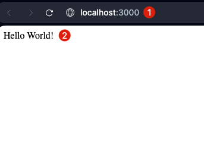
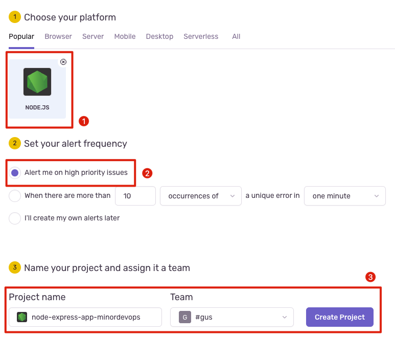
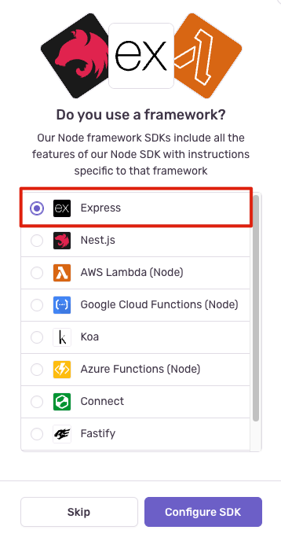
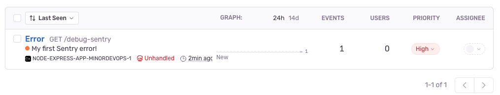

# Met Sentry naar een foutloze toekomst


*[Gus Theunissen, Oktober 2024.](https://github.com/hanaim-devops/blog-student-naam)*
<hr/>

## Inleiding

Voor de Minor DevOps aan de Hogeschool van Arnhem en Nijmegen schrijf ik een blogpost over Sentry, een tool die veel wordt gebruikt binnen de DevOps-wereld om de kwaliteit en prestaties van software te verbeteren. In DevOps en softwareontwikkeling is het proactief opsporen en oplossen van problemen van groot belang. Sentry biedt niet alleen error tracking, maar ook application performance monitoring (APM), waardoor ontwikkelaars snel en efficiënt problemen kunnen detecteren en oplossen.

Deze blogpost gaat dieper in op hoe je Sentry kunt integreren in een Node.js applicatie, hoe je het kunt gebruiken binnen een CI/CD-pipeline, en hoe het kan bijdragen aan een hogere softwarekwaliteit door fouten proactief te signaleren. Je krijgt bovendien een hands-on voorbeeld van de implementatie en configuratie in een real-world setting.

## Sentry

Sentry is een developer-first platform voor error tracking en performance monitoring. Het helpt ontwikkelaars om snel inzicht te krijgen in wat er daadwerkelijk misgaat in hun applicaties en om problemen efficiënt op te lossen. Door fouten en prestatieproblemen direct te signaleren, kunnen ontwikkelaars sneller reageren en zo de stabiliteit en prestaties van hun applicaties verbeteren. Sentry biedt niet alleen de mogelijkheid om problemen op te sporen, maar ook om continu te leren over het gedrag van je applicaties, zodat je proactief verbeteringen kunt doorvoeren.

Dit platform is ontworpen met ontwikkelaars in gedachten, wat betekent dat het eenvoudig te integreren is met veelgebruikte frameworks en tools zoals Node.js, Express, en CI/CD-systemen. Hierdoor kunnen teams hun software-ontwikkeling optimaliseren en een hogere mate van controle en inzicht behouden in hun productieomgevingen.

## Integratie met Node.js

Om Sentry te integreren in een Node.js applicatie met Express, beginnen we met het opzetten van een eenvoudige Node.js Express-applicatie. Ik heb ervoor gekozen om Node.js met Express te gebruiken omdat ik het Web Development profiel volg aan de Hogeschool van Arnhem en Nijmegen (HAN) en al veel ervaring heb met deze technologieën. Dit is de eerste stap voordat we Sentry toevoegen om fouten en prestaties te monitoren. Hier is een stapsgewijze handleiding:

### Stap 1: Node.js Installeren

Zorg ervoor dat je Node.js geïnstalleerd hebt op je systeem. Je kunt dit controleren door het volgende commando in je terminal te gebruiken:

```bash
node -v
```

Als je Node.js nog niet geïnstalleerd hebt, kun je de [installatie-instructies](https://nodejs.org/en/download/) volgen op de officiële Node.js-website.

### Stap 2: Express Applicatie Opzetten

Maak een nieuwe directory aan voor je applicatie en navigeer naar die map in je terminal:

```bash
mkdir my-sentry-app
cd my-sentry-app
```

Initialiseer een nieuw Node.js-project met npm:

```bash
npm init -y
```

Dit maakt een package.json bestand aan waarin de informatie over je project wordt opgeslagen.

### Stap 3: Express Installeren

Installeer Express in je project met npm:

```bash
npm install express
```

### Stap 4: Express Applicatie Schrijven

Creëer een bestand genaamd `app.js` in je project en voeg de volgende basiscode toe:

```js
const express = require('express');
const app = express();

// Maak een eenvoudige route die 'Hello World' retourneert
app.get('/', (req, res) => {
  res.send('Hello World!');
});

// Luister op poort 3000
app.listen(3000, () => {
  console.log('Server is running on http://localhost:3000');
});
```

### Stap 5: Applicatie Starten

Start je Express-applicatie met het volgende commando:

```bash
node app.js
```

Als alles goed is gegaan, zou je de tekst "Server is running on http://localhost:3000" in je terminal moeten zien. Je kunt je browser openen en navigeren naar http://localhost:3000, waar je "Hello World!" als output zou moeten zien.



*Figuur 1: Express-applicatie die "Hello World!" retourneert op http://localhost:3000*

### Stap 6: Sentry Integreren

Nu we een eenvoudige Express-applicatie hebben draaien, is het tijd om Sentry te integreren om fouten en prestaties te monitoren. 

Eerst hebben we een Sentry-account nodig om een project aan te maken en de benodigde configuratiegegevens te verkrijgen. Volg deze stappen om een Sentry-account aan te maken en een nieuw project te configureren:
- Log in op je [Sentry-account](https://sentry.io) of maak een nieuwe account aan als je er nog geen hebt.
- Maak een nieuw project aan in Sentry en volg de instructies om je project te configureren.
  - Kies een platform (in mijn geval Node.js).
  - Kies je alerting frequency.
  - Bedenk een naam voor je project en selecteer je team.



*Figuur 2: Nieuw project aanmaken in Sentry voor Node.js*

Nadat ik het project had aangemaakt kwam Sentry nog met de vraag of ik een framework gebruik. In mijn geval is dat Express, dus ik heb dat aangevinkt.



*Figuur 3: Framework selectie in Sentry*

Vervolgens krijg je een overzicht van de benodigde configuratiegegevens die je nodig hebt om Sentry te integreren in je Node.js applicatie.

### Stap 7: Sentry SDK Installeren

Volg de instructies in Sentry om de Sentry SDK te installeren in je Node.js project.

```bash
npm install --save @sentry/node @sentry/profiling-node
```

Vervolgens maak ik een `initSentry.js` bestand aan in mijn project en voeg ik de volgende code toe om Sentry te initialiseren:

```js
// Import with `import * as Sentry from "@sentry/node"` if you are using ESM
const Sentry = require("@sentry/node");
const { nodeProfilingIntegration } = require("@sentry/profiling-node");

Sentry.init({
  dsn: "YOUR_DSN_URL",
  integrations: [
    nodeProfilingIntegration(),
  ],
  // Tracing
  tracesSampleRate: 1.0, //  Capture 100% of the transactions

  // Set sampling rate for profiling - this is relative to tracesSampleRate
  profilesSampleRate: 1.0,
});
```

Vergeet niet om `YOUR_DSN_URL` te vervangen door de DSN (Data Source Name) die je hebt gekregen van Sentry. Dit is een unieke URL die Sentry gebruikt om fouten en prestaties te rapporteren aan jouw project.
Die kan er zo uitzien: `https://1a2b3c4f5g6h7i8j9k0l@1234567890.ingest.de.sentry.io/1234567`.

Het bestand `initSentry.js` initialiseert Sentry met de benodigde configuratiegegevens en activeert de integratie voor Node.js. Om dit bestand nu te gebruiken in je Express-applicatie, voeg je de volgende regel toe aan het begin van je `app.js` bestand:

```js
require('./initSentry');
```

Nu moeten we er nog voor zorgen dat Sentry de fouten en prestaties van onze Express-applicatie kan monitoren. Voeg dit toe aan je `app.js` bestand:

```js
const Sentry = require("@sentry/node"); // The Sentry SDK

Sentry.setupExpressErrorHandler(app); // This will add an error handler to the Express middleware chain and must also be added before any other error handlers.

// Add a route that throws an error for testing
app.use(function onError(err, req, res, next) {
  // The error id is attached to `res.sentry` to be returned
  // and optionally displayed to the user for support.
  res.statusCode = 500;
  res.end(res.sentry + "\n");
});
```

Voor het testen van Sentry voeg ik een route toe die een fout genereert. Ik voeg de volgende code toe aan mijn `app.js` bestand:

```js
app.get("/debug-sentry", function mainHandler(req, res) {
  throw new Error("My first Sentry error!");
});
```

Start je Express-applicatie opnieuw op met `node app.js` en navigeer naar http://localhost:3000/debug-sentry. Je zou nu een foutmelding moeten zien die door Sentry wordt opgevangen en gerapporteerd in je Sentry-dashboard.



*Figuur 4: Error reporting in Sentry*

## Bronnen!


