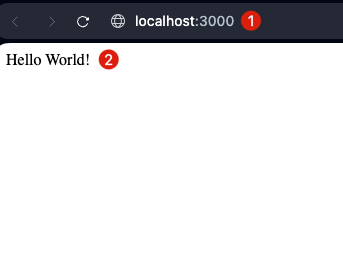
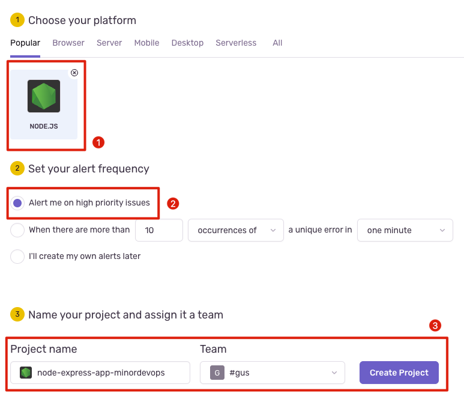
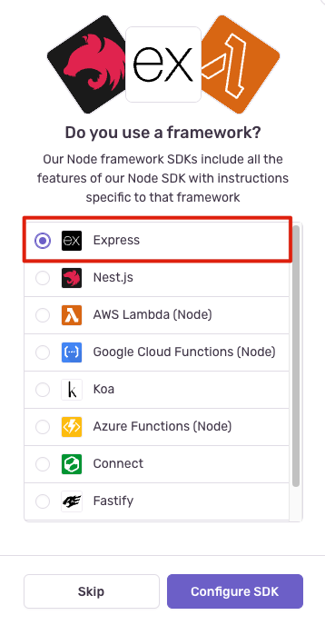
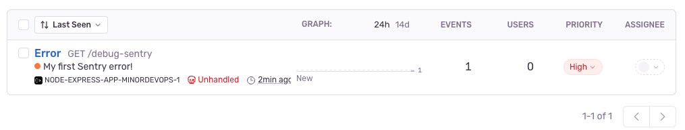
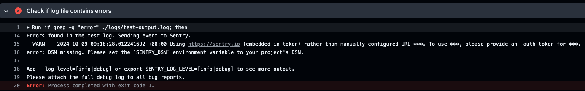
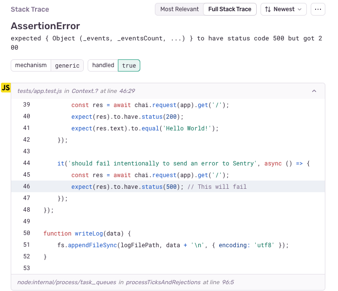

# Met Sentry naar een foutloze toekomst


*[Gus Theunissen, Oktober 2024.](https://github.com/hanaim-devops/blog-student-gus-theunissen)*
<hr/>

*Logo is afkomstig van: (Get the Sentry Logo, z.d.)*

## Inleiding

Voor de Minor DevOps aan de Hogeschool van Arnhem en Nijmegen (HAN) schrijf ik een blogpost over Sentry (Sentry, z.d.), een tool die veel wordt gebruikt binnen de DevOps-wereld om de kwaliteit en prestaties van software te verbeteren. In DevOps en softwareontwikkeling is het proactief opsporen en oplossen van problemen van groot belang. Sentry biedt niet alleen error tracking, maar ook application performance monitoring (APM), waardoor ontwikkelaars snel en efficiënt problemen kunnen detecteren en oplossen.

Deze blogpost gaat dieper in op hoe je Sentry kunt integreren in een Node.js (Node.js, z.d.) applicatie, hoe je het kunt gebruiken binnen een CI/CD-pipeline, en hoe het kan bijdragen aan een hogere softwarekwaliteit door fouten proactief te signaleren. Je krijgt bovendien een hands-on voorbeeld van de implementatie en configuratie in een real-world setting.

## Sentry

Sentry is een developer-first platform voor error tracking en performance monitoring dat ontwikkelaars helpt snel inzicht te krijgen in de problemen in hun applicaties en deze efficiënt op te lossen.

Dit platform is ontworpen met ontwikkelaars in gedachten, wat betekent dat het eenvoudig te integreren is met veelgebruikte frameworks en tools zoals Node.js, Express (Express, z.d.), en CI/CD-systemen. Hierdoor kunnen teams hun software-ontwikkeling optimaliseren en een hogere mate van controle en inzicht behouden in hun productieomgevingen.

## Integratie met Node.js

Om Sentry in een Node.js-applicatie met Express te integreren, starten we met het opzetten van een eenvoudige Express-applicatie.

### Stap 1: Node.js Installeren

We moeten ervoor zorgen dat Node.js is geïnstalleerd op ons systeem. Dit kunnen we controleren met het volgende commando in de terminal:

```bash
node -v
```

Als Node.js nog niet geïnstalleerd is, volgen we de installatie-instructies op de officiële Node.js-website.

### Stap 2: Express Applicatie Opzetten

Nu maken we een nieuwe directory aan voor onze Express-applicatie en navigeren we naar die map in de terminal:

```bash
mkdir my-sentry-app
cd my-sentry-app
```

Vervolgens initialiseren we een nieuwe Node.js-project met npm (NPM, z.d.):

```bash
npm init -y
```

Dit maakt een `package.json` bestand aan waarin de informatie over ons project wordt opgeslagen.

### Stap 3: Express Installeren

Nu installeren we Express in ons project met het volgende commando:

```bash
npm install express
```

### Stap 4: Express Applicatie Schrijven

Maak nu een bestand genaamd `app.js` en voeg de volgende basiscode toe:

```js
const express = require('express');
const app = express();

// Maak een eenvoudige route die 'Hello World' retourneert
app.get('/', (req, res) => {
  res.send('Hello World!');
});

// Luister op poort 3000
app.listen(3000, () => {
  console.log('Server is running on http://localhost:3000');
});
```

### Stap 5: Applicatie Starten

Start de Express-applicatie met het volgende commando:

```bash
node app.js
```

Als alles goed is gegaan, zien we nu de tekst "Server is running on http://localhost:3000" in de terminal. Navigeer nu in je browser naar http://localhost:3000 en zien we de boodschap "Hello World!".



*Figuur 1: Express-applicatie die "Hello World!" retourneert op http://localhost:3000*

### Stap 6: Sentry Integreren

Nu onze Express-applicatie draait, is het tijd om Sentry toe te voegen om fouten en prestaties te monitoren.

Eerst hebben we een Sentry-account nodig om een project aan te maken en de benodigde configuratiegegevens te verkrijgen. Dit zijn de stappen die we moeten volgen:
- Login op [Sentry-account](https://sentry.io).
- Daarna maken we een nieuw project aan met de volgende instellingen:
  - Platform (in ons geval Node.js).
  - Alerting frequency (standaard).
  - Een naam en team uitkiezen.



*Figuur 2: Nieuw project aanmaken in Sentry voor Node.js*

Nadat we het project hebben aangemaakt komt Sentry met de vraag of we een framework gebruiken. Aangezien we Express gebruiken, vinken we Express aan.



*Figuur 3: Framework selectie in Sentry*

Hierna krijgen we de configuratiegegevens die we nodig hebben om Sentry in ons project te integreren.

### Stap 7: Sentry SDK Installeren

Om de Sentry SDK (Software Development Kit) in ons Node.js-project te installeren, volgen we de instructies van Sentry:

```bash
npm install --save @sentry/node @sentry/profiling-node
```

Vervolgens maken we een `initSentry.js` bestand aan in ons project en voegen we de volgende code toe om Sentry te initialiseren:

```js
// Import with `import * as Sentry from "@sentry/node"` if you are using ESM
const Sentry = require("@sentry/node");
const { nodeProfilingIntegration } = require("@sentry/profiling-node");

Sentry.init({
  dsn: "YOUR_DSN_URL",
  integrations: [
    nodeProfilingIntegration(),
  ],
  // Tracing
  tracesSampleRate: 1.0, //  Capture 100% of the transactions

  // Set sampling rate for profiling - this is relative to tracesSampleRate
  profilesSampleRate: 1.0,
});
```

Nu vervangen we `YOUR_DSN_URL` door de DSN die we hebben gekregen van Sentry.

Om Sentry te gebruiken in onze Express-applicatie, voegen we de volgende regel toe aan het begin van ons `app.js` bestand:

```js
require('./initSentry');
```

### Stap 8: Fout- en Prestatiemonitoring Toevoegen

Voeg nu de Sentry-error handler toe aan je Express-applicatie om fouten en prestaties te monitoren:

```js
const Sentry = require("@sentry/node");

Sentry.setupExpressErrorHandler(app);

// Een algemene foutafhandelingsroute toevoegen
app.use(function onError(err, req, res, next) {
  res.statusCode = 500;
  res.end(res.sentry + "\n");
});
```

### Stap 9: Fouten Testen met Sentry

Voeg een route toe die opzettelijk een fout genereert om de Sentry-integratie te testen:

```js
app.get("/debug-sentry", function mainHandler(req, res) {
  throw new Error("My first Sentry error!");
});
```

Nu starten we de Express-applicatie opnieuw op met `node app.js` en navigeren we naar http://localhost:3000/debug-sentry. Sentry vangt nu deze foutmelding op en rapporteert deze in je Sentry-dashboard.



*Figuur 4: Error reporting in Sentry*

## Sentry in een CI/CD Workflow

Elke keer als we een push doen naar de `main`-branch, zorgen we ervoor dat we automatisch testen draaien en een Sentry-rapport genereren (een `.log` bestand waarin staat welke testen zijn gefaald) om te zien of er nog fouten optreden vóór een deploy. In deze sectie gebruiken we Github Actions (GitHub Actions, z.d.) binnen ons CI/CD-workflow. Omdat dit project momenteel op GitHub (GitHub, z.d.) staat en ik al ervaring heb met GitHub Actions, koos ik voor deze tool om het build- en deployproces te automatiseren.

### Stap 1: GitHub Actions Workflow Configureren

Nu startte we met het maken van een nieuwe workflow in je GitHub-repository door een bestand in de root van het project aan te maken met de naam `.github/workflows/sentry.yml`. In dit bestand definiëren we de stappen die de GitHub Action moet uitvoeren bij elke push naar de `main`-branch.

Hier is de uitgebreide configuratie voor de GitHub Action:

```yml
name: CI/CD with Sentry

on:
  push:
    branches:
      - main

jobs:
  build:
    runs-on: ubuntu-latest

    steps:
      - name: Checkout code
        uses: actions/checkout@v2

      - name: Set up Node.js
        uses: actions/setup-node@v2
        with:
          node-version: '20'

      - name: Install dependencies
        run: npm install
        working-directory: ./src/my-sentry-app

      - name: Setup Sentry CLI
        uses: mathieu-bour/setup-sentry-cli@v1
        with:
          version: latest # optional if 'latest'
          url: ${{ secrets.SENTRY_DSN }}
          token: ${{ secrets.SENTRY_AUTH_TOKEN }} # from GitHub secrets
          organization: ${{ secrets.SENTRY_ORG }}
          project: ${{ secrets.SENTRY_PROJECT }}

      - name: Run tests and generate logs
        run: |
          mkdir -p ./logs
          npm test | tee ./logs/test-output.log
        working-directory: ./src/my-sentry-app
        continue-on-error: true  # Continue even if tests fail

      - name: Check if log file contains errors
        run: |
          if grep -q "error" ./logs/test-output.log; then
            echo "Errors found in the test log. Sending event to Sentry."
            sentry-cli send-event -m "Test failures detected" --logfile ./logs/test-output.log
          else
            echo "No errors found in the test log."
          fi
        working-directory: ./src/my-sentry-app
```

### Stap 2: Secrets Instellen

Om onze Sentry-integratie veilig te houden, voegen we enkele geheimen toe aan onze GitHub-repository:

- **SENTRY_AUTH_TOKEN**: Authenticatietoken van Sentry om veilig te communiceren met de Sentry API.
- **SENTRY_DSN**: Data Source Name voor jouw Sentry-project.
- **SENTRY_ORG**: Jouw Sentry-organisatie.
- **SENTRY_PROJECT**: Jouw Sentry-project.

### Testen toevoegen

Om de workflow te testen, voegen we een eenvoudige test toe aan ons project.

Nu maken we een nieuwe map `tests` aan in ons project en voegen we een bestand `app.test.js` toe met de volgende inhoud:

```js
const fs = require('fs');
const path = require('path');
const Sentry = require('@sentry/node');
const chai = require('chai');
const chaiHttp = require('chai-http');

const app = require('../app.js'); // Zorg ervoor dat het pad naar je app.js bestand klopt
const logFilePath = path.join(__dirname, '../logs/test-output.log'); // Log file path

chai.use(chaiHttp);
const { expect } = chai;

describe('Test API', () => {
  before(function () {
    // Maak een logbestand als het nog niet bestaat
    if (!fs.existsSync(logFilePath)) {
      fs.writeFileSync(logFilePath, '', { encoding: 'utf8' });
    }

    // Maak het logbestand leeg
    fs.writeFileSync(logFilePath, '', { encoding: 'utf8' });
  });

  afterEach(function () {
    if (this.currentTest.state === 'failed') {
      // Als de test gefaald is, stuur de error naar Sentry
      Sentry.captureException(this.currentTest.err);
      writeLog(`Test failed: ${this.currentTest.title} - Error: ${this.currentTest.err}`);
      console.error('Error captured and sent to Sentry:', this.currentTest.err);
    }
  });

  it('should return error', async () => {
    const res = await chai.request(app).get('/debug-sentry');
    expect(res).to.have.status(500);
  });

  it('should return Hello World', async () => {
    const res = await chai.request(app).get('/');
    expect(res).to.have.status(200);
    expect(res.text).to.equal('Hello World!');
  });
});

function writeLog(data) {
  fs.appendFileSync(logFilePath, data + '\n', { encoding: 'utf8' });
}
```

Voor de testen gebruiken we Mocha (Mocha, z.d.) en Chai (Chai, z.d.).

Verander de `scripts` in je `package.json` bestand om de testen te draaien:

```json
{
  "scripts": {
    "test": "mocha tests/**/*.js --timeout 10000 --exit"
  }
}
```

### Workflow uitvoeren

Nu we onze workflow en geheimen heb ingesteld, de testen zijn gemaakt, wordt de workflow automatisch uitgevoerd telkens als we een push doen naar de `main`-branch. GitHub Actions zal de code controleren, afhankelijkheden installeren en tests uitvoeren.

Als de tests echter falen, wordt er een foutmelding naar Sentry gestuurd met het bestand `test-output.log`. In dit bestand staat elke error die uit de testen zijn gekomen.

Commit en push nu je wijzigingen naar de `main`-branch om de workflow te activeren. We zien nu dat de workflow faalt.



*Figuur 5: Foutmelding bij het sturen van een event naar Sentry*

Om het event te sturen naar ons Sentry project, gebruiken we de Github Action `mathieu-bour/setup-sentry-cli@v1`. Deze action zorgt ervoor dat de Sentry CLI wordt geïnstalleerd en geconfigureerd met de juiste gegevens. 
Echter, in ons geval faalde het sturen van de event omdat de `SENTRY_DSN` niet correct was geconfigureerd. Na wat onderzoek loopt deze Github Action achter en kunnen we geen `SENTRY_DSN` instellen.

### Stap 3: Alternatieve Oplossing

De alternatieve oplossing is om elke error die optreedt tijdens de testen te vangen en naar Sentry te sturen door de Sentry SDK te gebruiken in de testen zelf.

Nu voegen we de volgende code toe aan het `app.test.js` bestand om de errors naar Sentry te sturen:

```js
afterEach(function () {
    if (this.currentTest.state === 'failed') {
        // Als de test gefaald is, stuur de error naar Sentry
        Sentry.captureException(this.currentTest.err);
        console.error('Error captured and sent to Sentry:', this.currentTest.err);
    }
});
```

Nadat elke test is uitgevoerd, wordt er gekeken of de test is gefaald. Als dat het geval is, wordt de error naar Sentry gestuurd met `Sentry.captureException(this.currentTest.err)`.

Nu voegen we nog een extra test toe die opzettelijk faalt om te zien of de errors correct naar Sentry worden gestuurd:

```js
it('should fail intentionally to send an error to Sentry', async () => {
  const res = await chai.request(app).get('/');
  expect(res).to.have.status(500); // This will fail
});
```

Nu zorgen we ervoor dat de wijzigingen worden gecommit en gepusht naar de `main`-branch van je GitHub-repository. De GitHub Action `sentry.yml` wordt nu uitgevoerd en de errors worden naar Sentry gestuurd.



*Figuur 6: Error reporting in Sentry na het falen van een test*

## Sentry Alerting en Monitoring

Om Sentry proactief te gebruiken voor het detecteren en oplossen van problemen, kun je gebruikmaken van zowel de standaard meldingsfunctionaliteit (zoals e-mails) als andere integraties zoals Slack. Hier zijn een aantal best practices voor het effectief inzetten van Sentry voor proactieve monitoring (Alerts, z.d.).

### 1. Meldingen via e-mail

Sentry stuurt standaard meldingen via e-mail wanneer nieuwe fouten worden gedetecteerd. Je kunt e-mails instellen zodat alleen specifieke types van fouten worden gerapporteerd, of meldingen beperken op basis van de frequentie of het aantal keren dat dezelfde fout optreedt.

### 2. Integratie met Slack

Voor snellere communicatie en teamcollaboratie kun je een Slack-integratie opzetten. Met deze integratie kun je directe meldingen van fouten in Slack-kanalen ontvangen, zodat je snel kunt reageren zonder e-mails in de gaten te hoeven houden.

### 3. Issue Triage en Foutprioritering

- **Proactieve triage**: Sentry biedt inzicht in welke fouten de meeste impact hebben op je gebruikers. Dit kan helpen bij het proactief oplossen van problemen door fouten te prioriteren op basis van impact.
- **Resolutions**: Wanneer je een fout in Sentry oplost, kun je deze markeren als "resolved". Als deze fout opnieuw voorkomt, krijg je meteen een melding, wat helpt bij het snel identificeren van regressies.

### 4. Prestatiemonitoring

Sentry biedt ook mogelijkheden voor performance monitoring naast foutenmonitoring. Dit stelt je in staat om traagheid in de applicatie op te sporen of langzame API-calls te detecteren. Met Transaction Tracing kun je performance-issues analyseren door te zien welke delen van de code problemen veroorzaken. (Performance Monitoring, z.d.)

Proactief gebruik van Performance Monitoring:
- Stel een threshold in voor laadtijden, zodat je meldingen ontvangt wanneer bepaalde transacties langer duren dan verwacht.
- Gebruik de Apdex-score om de tevredenheid van je gebruikers met de applicatieperformance in de gaten te houden. Wanneer de score daalt, kun je proactief ingrijpen.

### 5. Advanced Alerts en Automatiseringen

Sentry ondersteunt ook meer geavanceerde waarschuwingen, zoals:
- **Rate-limiting** alerts: Waarschuwingen wanneer bepaalde fouten binnen een korte tijdspanne meerdere keren optreden.
- **Webhooks**: Als je naast Slack andere tools gebruikt zoals Jira, Trello of PagerDuty, kun je meldingen ook via webhooks versturen om automatisch taken aan te maken of escalaties te triggeren.

## Conclusie

Sentry biedt waardevolle functionaliteiten voor het monitoren en opsporen van fouten binnen applicaties, vooral in productieomgevingen. Hoewel Sentry traditioneel gezien gericht is op het verbeteren van softwarekwaliteit, is het ook een krachtige tool binnen een DevOps-context. Het stelt teams in staat om proactief te reageren op productieproblemen en draagt bij aan een snellere feedbackloop door integratie in CI/CD-pijplijnen.

De kracht van Sentry ligt in de samenwerking tussen ontwikkeling en operaties. Door real-time foutmeldingen, prestatiemonitoring en geautomatiseerde alerts kunnen teams effectiever werken, sneller itereren en de algehele gebruikerservaring verbeteren. Hierdoor bevordert Sentry de kernprincipes van DevOps: continue verbetering, samenwerking en een focus op de eindgebruiker.

Al met al toont het gebruik van Sentry aan dat het niet alleen een tool is voor foutopsporing, maar ook een integraal onderdeel kan zijn van een DevOps-strategie die streeft naar een hogere kwaliteit en stabiliteit van softwaretoepassingen.

## Bronnen!

- Scribbr. (2023b, juli 27). *Gratis bronnengenerator | Genereer je literatuurlijst | Scribbr*. Geraadpleegd op 9 oktober 2024, van https://www.scribbr.nl/bronvermelding/generator/
- Sentry. (z.d.). *Sentry*. Geraadpleegd op 9 oktober 2024, van https://sentry.io/welcome/
- Node.js. (z.d.). *Node.js*. Geraadpleegd op 9 oktober 2024, van https://nodejs.org/en
- Express. (z.d.). *Express*. Geraadpleegd op 9 oktober 2024, van https://expressjs.com/
- NPM. (z.d.). *Npmjs*. Geraadpleegd op 9 oktober 2024, van https://www.npmjs.com/
- GitHub. (z.d.). *GitHub*. Geraadpleegd op 9 oktober 2024, van https://github.com/
- GitHub Actions. (z.d.). *GitHub*. Geraadpleegd op 9 oktober 2024, van https://github.com/features/actions
- Mocha. (z.d.). *Mocha*. Geraadpleegd op 9 oktober 2024, van https://mochajs.org
- Chai. (z.d.). *Chai*. Geraadpleegd op 9 oktober 2024, van https://www.chaijs.com/
- Alerts. (z.d.). *Sentry*. Geraadpleegd op 9 oktober 2024, van https://docs.sentry.io/product/alerts/
- Performance monitoring. (z.d.). *Sentry*. Geraadpleegd op 9 oktober 2024, van https://docs.sentry.io/product/performance/
- Week 6 - Onderzoek - Minor DevOps materiaal v1.1.0 (laatste update: unknown). (z.d.). *Minor DevOps*. Geraadpleegd op 9 oktober 2024, van https://minordevops.nl/week-6-onderzoek/index.html
- AIM Controlekaart - Minor DevOps materiaal v1.1.0 (laatste update: unknown). (z.d.). *Minor DevOps*. Geraadpleegd op 9 oktober 2024, van https://minordevops.nl/week-6-onderzoek/aim-controle-kaart.html
- Get the Sentry Logo. (z.d.). *Sentry*. https://sentry.io/branding/

Bij dit onderzoek is ChatGPT gebruikt om de tekst te genereren, verbeteren en aan te vullen. Hiernaast is elk stukje tekst gecontroleerd of het correct is en of het past binnen de context van het onderzoek (bekijk altijd de documentatie van de gebruikte software, die zijn het meest actueel).
Klik [hier](https://chatgpt.com/share/67065b7b-4ff4-800d-b381-4454aa7393ad) om de gebruikte chat te openen.
